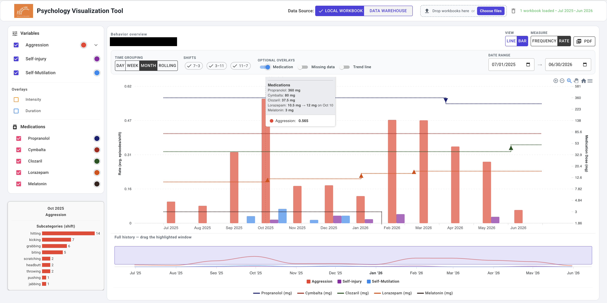

# Psych Clinical Behavior Viz Tool

## Overview

The Psychology Visualization Tool helps clinical staff explore behavior history alongside medication changes. Load Excel behavior workbooks or use configured warehouse CSV exports, then select behaviors, shifts, and a date range to explore the data.



The example above shows monthly behavior rates as colored bars with medication doses overlaid as dotted lines. Hovering over the chart displays behavior values and medication details; the left panel breaks down behavior subcategories. Drag the highlighted window below the chart to explore a different period.

## Features

- **Workbook uploads:** Drag and drop or choose `.xlsx`, `.xlsm`, or `.xls` files. Combine workbooks to explore multiple years of history.
- **Behavior comparisons:** Choose which behaviors to display, switch between line and bar charts, and compare frequency or rate per recorded shift.
- **Time and shift filters:** Group observations by day, week, month, or rolling view; select shifts and adjust the date range.
- **Optional overlays:** Show medication dose changes, intensity, duration, missing data, and trend lines.
- **Interactive exploration:** Inspect hover details, zoom into the chart, and navigate the full history using the range selector.
- **PDF export:** Export the current chart view for sharing or review.

## Getting Started

### Prerequisites

- [.NET 8 SDK](https://dotnet.microsoft.com/download/dotnet/8.0) or later.

### Running Locally

1. Clone the repository:
   ```bash
   git clone https://github.com/jconoranderson/Psych_Clinical_Behavior_Viz_Tool.git
   ```
2. Navigate to the project directory:
   ```bash
   cd Psych_Clinical_Behavior_Viz_Tool
   ```
3. Run the application:
   ```bash
   dotnet watch run
   ```
4. Open your browser to the URL indicated in your terminal. The HTTP launch profile uses `http://localhost:5008`.

## Workbook loading

If a workbook cannot be read or contains no readable behavior data, the upload message identifies the file. No files from the failed batch are added, and previously loaded data remains available. Differences or repeated labels in workbook headers do not block loading.

## Technologies Used

- [ASP.NET Core Blazor](https://dotnet.microsoft.com/en-us/apps/aspnet/web-apps/blazor)
- [MudBlazor](https://mudblazor.com/)
- [Blazor-ApexCharts](https://github.com/apexcharts/Blazor-ApexCharts)
- [CsvHelper](https://joshclose.github.io/CsvHelper/)
